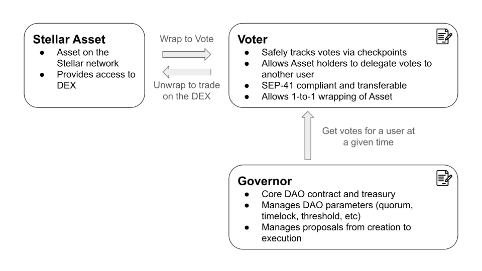

# Soroban Governor Architecture
Soroban Governor is a comprehensive governance framework based on the [OpenZeppelin Governance system](https://docs.openzeppelin.com/contracts/5.x/governance). The design is optimized for the Soroban environment and support for Stellar Classic assets.

## Overview

Soroban Governor is made up of two primary contracts: Governor and Voter. The Governor is the core contract that is responsible for proposal and treasury management. The Voter is an extension contract that manages voting power and delegation. The protocol is purposefully designed such that the DAO token is a Stellar Asset, but the Voter contract can be used with any CAP-41 compliant token.

### System Diagram

## Governor

The Governor contract is the core contract of the governance system. Its core responsibility is managing the proposal workflow. Proposals allow the Governor contract to interact with the greater Soroban ecosystem, enabling things like the Governor sending funds to a grant recipient or depositing into an AMM.

### Parameters

The Governor manages a handful of parameters that define how the proposal flow is handled. These are defined on creation but can be changed via proposal.

* Proposal Threshold `i128`
    * The votes required to create a proposal.
* Vote Delay `u64`
    * The delay (in seconds) from the proposal creation to when the voting period begins. The voting period start time will be the checkpoint used to account for all votes for the proposal.
* Vote Period `u64`
    * The time (in seconds) the proposal will be open to vote against.
* Timelock `u64`
    * The time (in seconds) the proposal will have to wait between vote period closing and execution.
* Quorum `u32`
    * The percentage of votes (expressed in BPS) needed of the total available votes to consider a vote successful.
* Counting Type `u32`
    * Determine which votes to count against the quorum out of for, against, and abstain. The value is encoded such that only the last 3 bits are considered, and follows the structure `MSB...{for}{against}{abstain}`, such that any value != 0 means that type of vote is counted in the quorum. For example, consider 5 == `0x0...0101`, this means that votes "for" and "abstain" are included in the quorum, but votes "against" are not.
* Vote Threshold `u32`
    * The percentage of votes "yes" (expressed in BPS) needed to consider a vote successful.

Protocol Requirements:
* Max Life
    * The max life of a proposal must be under 21 days, that is, the time from creation to execution must occur in at most 21 days. This is checked by totaling the values of `vote delay`, `vote period`, and `timelock`. This restriction is due to ensure proposals and vote checkpoints can be safely stored in temporary storage, significantly reducing cost.

### Proposal

A proposal is a set of calldata and metadata that users are able to vote on. Upon creation, a vote start window is created `vote delay` seconds in the future. Due to Soroban's cheap temporary storage and the proposals definite life span, all relevant information for a proposal is stored on chain to allow all parties a simple way to fetch and analyze proposal contents.

**Proposal Contents:**
* calldata `Vec<Vec<Val>>`
    * A Vector of functions to call on execution
* sub_calldata `Vec<Vec<Val>>`
    * A vector of `SubContractInvocation` calldata to create contract authorization objects for
* description `String`
    * A description of the proposal
    * TODO: Determine if storing this all in temporary storage is cheap enough of if structured data will need to be stored in IPFS instead, and determine a consistent structure for frontends to consume
* proposer `Address`
    * The user who created the proposal
* vote_start `Timestamp`
    * The ledger timestamp where votes will be fetched from and when voting can begin
* vote_end `Timestamp`
    * The ledger timestamp voting will close at

TODO: Determine if calling multiple contracts will be significantly more complicated than calling a single contract. Multi-calls can be encoded in deployed WASM contracts if required. If so, reduce interface to only a single Vec for both `calldata` and `sub_calldata`.

## Voter

The Voter contract is a SEP-41 compliant token that tracks both their token balance and a historical checkpoint for votes. To use a Voter contract, a user must maintain a balance of the Stellar Asset, transfer the tokens to the Voter contract, and specify a delegate to manage the votes (this can be themselves).

By default, this contract will extend the metadata of the Stellar Asset with a symbol of `vote{AssetCode}` and retain the rest of the metadata. There is no requirement to for the issuer of the token, but an unlocked issuer on the Stellar Asset does grant the issuer full control of the DAO, and is not a suggested setup.

### Token Implementation

This token is SEP-41 compliant and can be transferred freely. The token balance for a user is tracked separately from their delegation, meaning they are able to trade these tokens on Soroban even if they have delegated their votes to another address.

### Delegation

A user can delegate their votes to a single address, which can be themselves. This causes votes to be tracked with checkpoints. If the user changes their delegate address, all active votes are moved from the old delegate to the new one.

If a user does not delegate, no checkpoints will be tracked and vote tokens can be traded for a significantly reduced state cost, but the tokens will not be able to be used to vote for a proposal.

### Checkpoints

A checkpoint system is designed to track important time periods from the Governor and ensure that accurate vote totals are tracked. This protects against things like a flash loan attack, where a user could gather a large amount of tokens via a flash loan, vote on a proposal, then return the tokens, effectively gathering an unfair amount of votes.

The checkpoint system is defined by a relevant set of timestamps from the Governor. Each time a proposal is created, the proposal vote start time is sent to the Voter and tracked. The last 30 days of relevant timestamps are tracked in temporary storage.

Every user with votes maintains a `Votes` persistent data entry and a `Vec<Votes>` temporary entry such that `Votes` contains:

Votes:
* amount `i128`
    * The amount of votes the user has
* timestamp `Timestamp`
    * The time this amount was updated

This ensures that each user never loses their votes, and they can always be restored.

When an update to a user's `votes` entry occurs (e.g. if they transfer tokens, or someone who is delegating to the user), a check is performed to see if there is any relevant timestamp between the last time `votes` was updated and now. If there is, the old `votes` entry is placed at the front the `Vec<Votes>` array, and the new `votes` entry is placed in the persistent slot so that the appropriate number of votes can be recovered for that timestamp.

A user's votes for a given timestamp can be recovered by fetching the first `Votes` instance that can be found such that the update timestamp is less than or equal to the given timestamp.

### Non-Stellar Asset Token

The Voter can be modified to support a non-Stellar Asset by removing the `wrap`, `unwrap` and `wrap_and_delegate` functions, and extending it with any required custom features for your token.