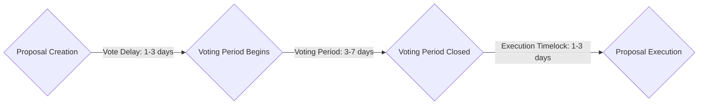

 # Soroban Governor Architecture

- [Overview](#overview)
- [Governor](#governor)
    - [Parameters](#parameters)
    - [Proposal](#proposal)
        - [Proposal Contents](#proposal-contents)
        - [Proposal Types](#proposal-types)
        - [Proposal Lifecycle](#proposal-lifecycle)
- [Voter](#voter)
    - [Delegation](#delegation)
    - [Checkpoints](#checkpoints)
    - [Soroban Votes](#soroban-votes)
    - [Soroban Admin](#soroban-admin)
    - [Soroban Bonding](#soroban-bonding)

## Overview

Soroban Governor is made up of two primary contracts: Governor and Voter. The Governor is the core contract that is responsible for proposal and treasury management. The Voter is a contract that manages voting power and delegation. Often times the Voter will often act as the "protocol token" or "governance token". This library includes 3 different Voter implementations to support a majority of cases, and act as examples for any custom implementation that could be required.

## Governor

The Governor contract is the core contract of the governance system. Its core responsibility is managing the proposal workflow. Proposals allow the Governor contract to interact with the greater Soroban ecosystem, enabling things like the Governor sending funds to a grant recipient or depositing into an AMM.

### Parameters

The Governor manages a handful of parameters that define how the proposal flow is handled. These are defined on creation but can be changed via proposal.

* Council `Address`
    * The address of the security council that can cancel proposals during the vote delay period. If the Governor does not have a council, this should be set to the zero address.
* Proposal Threshold `i128`
    * The votes required to create a proposal.
* Vote Delay `u32`
    * The delay (in ledgers) from the proposal creation to when the voting period begins. The voting period start time will be the checkpoint used to account for all votes for the proposal.
* Vote Period `u32`
    * The time (in ledgers) the proposal will be open to vote against.
* Timelock `u32`
    * The time (in ledgers) the proposal will have to wait between vote period closing and execution.
* Grace Period `u32`
    * The time (in ledgers) the proposal has to be executed before it expires, starting after the timelock; and the time the proposal has to be closed, starting after the vote period has finished.
* Quorum `u32`
    * The percentage of votes (expressed in BPS) needed of the total available votes to consider a vote successful.
* Counting Type `u32`
    * Determine which votes to count against the quorum out of for, against, and abstain. The value is encoded such that only the last 3 bits are considered, and follows the structure `MSB...{for}{against}{abstain}`, such that any value != 0 means that type of vote is counted in the quorum. For example, consider 5 == `0x0...0101`, this means that votes "for" and "abstain" are included in the quorum, but votes "against" are not.
* Vote Threshold `u32`
    * The percentage of votes "yes" (expressed in BPS) needed to consider a vote successful.

Protocol Requirements:
* Max Life
    * The max life of a proposal must be at most 31 days, that is, the time from creation to execution must occur in at most 31 days. This is checked by totaling the values of `vote delay`, `vote period`, `timelock`, and `grace period * 2`. This restriction is due to ensure proposals and vote checkpoints can be safely stored in temporary storage, significantly reducing cost.
* Max `vote period`
    * The max vote period of a proposal is 7 days. This ensures the Votes contract does not need to track an unnecessary amount of voting checkpoints.

### Proposal

A proposal is an action the Governor can take that user's get to vote on. Due to Soroban's cheap temporary storage and the proposals definite life span, all relevant information for a proposal is stored on chain to allow all parties a simple way to fetch and analyze proposal contents. 

#### **Proposal Contents**

* id `u32`
    * An incrementing identifier based on proposal creation ledger for the proposal.
* config `ProposalConfig`
    * action `ProposalAction`
        * The action the Governor can take in the event the proposal is successful.
    * title `String`
        * The title of the proposal.
    * description `String`
        * A description for the proposal (supports markdown).
* data `ProposalData`
    * creator `Address`
        * The address of the account creating the proposal
    * vote_start `u32`
        * The ledger sequence when voting period begins (exclusive). This is also the ledger sequence votes will be counted at.
    * vote_end `u32`
        * The ledger sequence when the voting period ends (inclusive)
    * eta `u32`
        * The ledger sequence when the proposal will be executed, or zero if no execution has been scheduled.
    * status `ProposalStatus`
        * The status of the proposal (`Open`, `Successful`, `Defeated`, `Expired`, `Executed`, `Canceled`).
    * executable `bool`
        * A flag defining if the proposal can be executed or not.

#### **Proposal Types**

The proposal action defines the proposal type. A proposal can be one of 4 types: `Calldata`, `Upgrade`, `Settings`, and `Snapshot`.

* Calldata
    * A calldata proposal defines a contract call and the required authentication to be made by the Governor contract. If the proposal is successful, the Governor will invoke the contract and function defined by the calldata during execution.
* Upgrade
    * An upgrade proposal defined a new WASM hash for the Governor to be upgraded too. This type of proposal can only be created by the `Security Council`. If the proposal is successful, the Governor will upgrade its WASM implementation to the new WASM during execution.
* Settings
    * A settings proposal defines a new set of [parameters](#parameters) for the Governor. If the proposal is successful, the Governor will use the new parameters.
* Snapshot
    * A snapshot proposal does not contain any action, and only contains a title and description. These proposals also do not need to wait for the `Vote Delay`, and there vote period starts immediately. The proposal result does not matter, as the proposal cannot be executed.

#### **Proposal Lifecycle**

Proposals pass through a couple of states during their lifetime, from creation to execution.

Proposal Creation
* A created proposal is initially placed in the `Open` status, and given `vote_start` and `vote_end` times based on the current `Vote Delay` and `Vote Period`.
* A proposal can be canceled by either the `creator` or the `Security Council` while the current ledger is less than `vote_start`. If this occurs, the proposal will be moved to the `Canceled` status.

Vote Period
* Users can begin voting if the current ledger is within (and including) the `vote_start` and `vote_end` ledgers. Voting power is determined by fetching `get_past_votes` against the Voter contract for the `vote_start` ledger.
* Users can vote with the following support options:
    * 0 - against
    * 1 - for
    * 2 - abstain
* Once a vote is cast it cannot be changed

Vote Closure
* Anyone can close a proposal once `vote_end` ledger has passed.
* If the `vote_end` ledger was more than `grace_period` ledgers in the past, the proposal will be moved to `Expired` status.
* The votes are tallied and checked if they meet both the current `qourum` and `threshold` parameters for the Governor.
    * If BOTH `quorum` and `threshold` checks pass -> the proposal is moved to `Successful` status
    * Else -> the proposal is moved to `Defeated` status

Proposal Execution
* Anyone can execute a proposal if it is in the `Successful` status, and the current ledger is at least `timelock` ledgers after `vote_end`. Once executed, the proposal will be moved to the `Executed` status.
* If the current ledger is more than `timelock` + `grace_period` ledgers after `vote_end`, the proposal will be moved to the `Expired` status and cannot be executed.

## Voter

The Voter contract tracks both a balance and a historical checkpoint for votes. The contract also supports delegation which allows users to delegate the votes based on their balance to another user.

This library includes 3 different Voter contract implementations:
* Soroban Votes
    *  A SEP-41 compliant Soroban token with an `admin` that can mint tokens.
* Soroban Admin
    * A non-transferable token with an `admin` that can both mint and clawback tokens.
* Soroban Bonding
    * A non-transferable token that can be bonded and unbonded with a single Stellar Asset. This allows Stellar Assets to be used safely in Soroban Governor.

All custom Voter tokens share the same Voter implementation, which includes Delegation and Checkpoints.

### Delegation

A user can delegate their votes to a single address, which by default is themselves. If the user changes their delegate address, all active votes as a result of their Voter token balance are moved to the delegate.

Delegations cannot be chained. That is, a user can only delegate their Voter token balance to another user, not any votes that have been delegated to them.

### Checkpoints

A checkpoint system is designed to track important time periods from the Governor and ensure that accurate vote totals are tracked. This protects against things like a flash loan attack, where a user could gather a large amount of tokens via a flash loan, vote on a proposal, then return the tokens, effectively gathering an unfair amount of votes.

Checkpoints are stored in temporary storage, and values are stored long enough to ensure safe access of voting power history based on a Governor's proposals. Each time a proposal is created, the `vote_start` timestamp is reported to the `Voter` implementation and tracked for at least `Max Proposal Lifetime`. Any voting power change that occurs over a `vote_start` ledger for a proposal is tracked with a checkpoint.

Every user with votes maintains a `Checkpoint` persistent data entry and a `Vec<Checkpoint>` temporary entry such that `Checkpoint` contains:

Checkpoint:
* amount `i128`
    * The amount of votes the user has. This has an artificial value range of `u96` to ensure the checkpoint can be safely stored as a `u128`. This means negative cannot be stored as a checkpoint.
* sequence `u32`
    * The ledger where the checkpoint was created.

The persistent data entry ensures that each user never loses their votes, and they can always be restored.

When an update to a user's `Checkpoint` entry occurs (e.g. if they transfer tokens, or someone who is delegating to the user), the old `Checkpoint` entry is placed at the back of the `Vec<Checkpoint>` array, and the new `Checkpoint` entry is placed in the persistent slot. This ensures the `Vec<Checkpoint>` array is ordered such that the `sequence` is always increasing. 

A user's votes for a given ledger can be recovered by fetching the first `Checkpoint` instance that can be found such that the `sequence` the `Checkpoint` was created is less than or equal to the given ledger.

### Soroban Votes

The Soroban Votes implementation is a fully featured `SEP-0041` Soroban token. This is the most similar option to EVM usage of governance tokens, like OpenZepplin's [ERC20Votes](https://github.com/OpenZeppelin/openzeppelin-contracts/blob/master/contracts/token/ERC20/extensions/ERC20Votes.sol) or Compound's [COMP token](https://github.com/compound-finance/compound-governance/blob/main/contracts/Comp.sol).

### Soroban Admin

The Soroban Admin implementation grants an `admin` the ability to define voting power for users, and is non-transferable so users cannot change their balance. Users are still able to delegate their voting power.

The `admin` can both:
* mint tokens to a user
* clawback tokens from a user

This allows voting power to be defined by something other than a token. For example, a contract could implement a way to distribute votes based on governance voting participation. This contract would be the `admin` of a Soroban Admin token, and then have the permissions to control voting power.

### Soroban Bonding

The Soroban Bonding implementation is an extension contract to a Stellar Asset that allows the asset to be safely used in governance systems. Due to issues like double counting, Stellar Assets cannot safely be used as a voting token for a governance system. This contract acts as a Soroban wrapper to bring both checkpoints and delegation to a Stellar Asset.

To get bonded voter tokens, a user can bond their Stellar Asset into the Soroban Bonding contract at a 1-1 rate. These tokens can be unbonded at any time for the user's original Stellar Assets at a 1-1 rate. Bonded voter tokens are non-transferable.