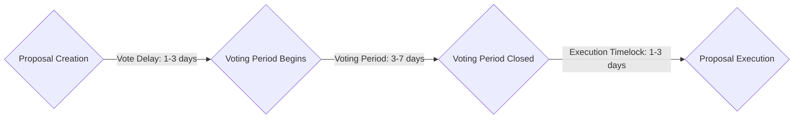

# DAO Proposal Lifecycle

This document outlines the lifecycle of a proposal made using the Soroban Governor DAO system.

## Proposal Creation

1. A member of the DAO creates a new proposal by submitting a proposal transaction to the Governor contract.
2. The proposal transaction includes details such as the proposal's title, description, and any necessary execution parameters.
3. The proposal is assigned a unique proposal ID by the Governor contract.

## Proposal Voting

1. Once a proposal is created, and the `vote_delay` expires it enters the voting period.
2. During the voting period, DAO members can cast their votes in favor or against the proposal.
3. Each member's voting power is determined by the number of governance tokens they hold.
4. The voting period typically lasts for a specified number of blocks defined by the `voting_period` Governance setting stored on the Governor contract.

## Voting Closure

1. Once the `voting_period` has ended, the proposal is closed and no more voting can occur.
2. The votes are tallied and: - If the proposal has not met the `quorum` requirement it is discarded. - If the proposal fails to meet `voting_threshold` (percent of "YES" votes) it is discarded.

## Proposal Execution

1. After a proposal is successfully closed and the execution `timelock` passes the proposal can be executed.
2. Anyone can call the `execute()` function on the governor and it will generate and submit a transaction using the calldata stored on the proposal.

# Graph of Proposal Process:

